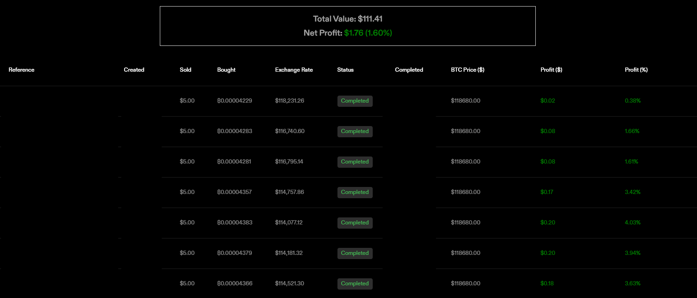

# Strike.me Profit Tracker Plugin

Simple browser extension to display profit/loss for BTC purchases on Strike.me

The plugin makes a request to [CoinDesk](https://data-api.coindesk.com/spot/v1/latest/tick?market=kraken&instruments=BTC-USD&apply_mapping=true) to fetch the current BTC price, then adds some columns to the table on the Transactions page. Also displays a little banner with Total Value and Net Profit.

## Build

A `Makefile` is available to automate building for Chrome and Firefox from a Linux environment.

The following dependencies are required to build: `jq, zip, rsync, node, npx`

### Build Commands

- `make [all]` - Build for both Chrome and Firefox
- `make [chrome|firefox]` - Build for just Chrome or Firefox
- `make clean` - Delete built files

## License: MIT

Copyright 2025 idwpan

Permission is hereby granted, free of charge, to any person obtaining a copy of this software and associated documentation files (the “Software”), to deal in the Software without restriction, including without limitation the rights to use, copy, modify, merge, publish, distribute, sublicense, and/or sell copies of the Software, and to permit persons to whom the Software is furnished to do so, subject to the following conditions:

The above copyright notice and this permission notice shall be included in all copies or substantial portions of the Software.

THE SOFTWARE IS PROVIDED “AS IS”, WITHOUT WARRANTY OF ANY KIND, EXPRESS OR IMPLIED, INCLUDING BUT NOT LIMITED TO THE WARRANTIES OF MERCHANTABILITY, FITNESS FOR A PARTICULAR PURPOSE AND NONINFRINGEMENT. IN NO EVENT SHALL THE AUTHORS OR COPYRIGHT HOLDERS BE LIABLE FOR ANY CLAIM, DAMAGES OR OTHER LIABILITY, WHETHER IN AN ACTION OF CONTRACT, TORT OR OTHERWISE, ARISING FROM, OUT OF OR IN CONNECTION WITH THE SOFTWARE OR THE USE OR OTHER DEALINGS IN THE SOFTWARE.
